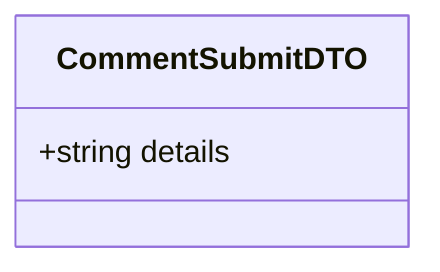
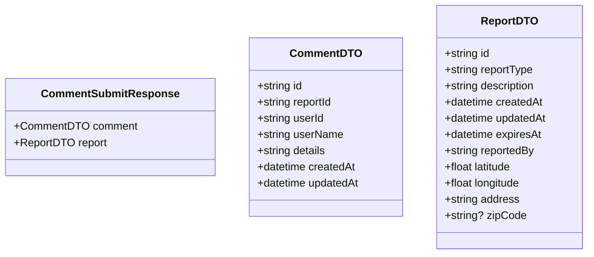

# Add Comment Use Case

An authenticated user adds a comment to a report.

## Flow

1. User views a report
2. User writes a comment
3. User submits the comment
4. Comment is saved and visible to other users

## Endpoints

### POST `/reports/:reportId/comments`

**REQUIRES AUTHENTICATED USER**

#### Request Body

```json
{
    "details": "comment text here" // 1-1024 chars
}
```



#### Response

`201 Created`

```json
{
    "comment": {
        "id": "uuid",
        "reportId": "uuid",
        "userId": "uuid",
        "userName": "John Doe",
        "details": "comment text here",
        "createdAt": "2026-05-23T10:00:00Z",
        "updatedAt": "2026-05-23T10:00:00Z"
    },
    "report": {
        "id": "uuid",
        "reportType": "accident",
        "description": "description",
        "createdAt": "2026-05-23T08:00:00Z",
        "updatedAt": "2026-05-23T10:00:00Z",
        "expiresAt": "2026-05-23T12:00:00Z",
        "reportedBy": "uuid",
        "latitude": 40.205,
        "longitude": 21.443,
        "address": "address",
        "zipCode": "51030"
    }
}
```



#### Failure Responses

| Status | Condition |
|--------|-----------|
| `400` | Missing or invalid details (1-1024 chars) |
| `401` | Missing or invalid authentication |
| `404` | Report not found |
