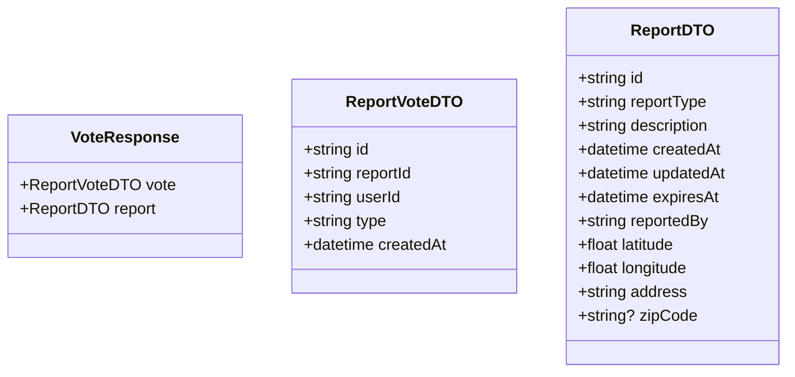

# Confirm Report Use Case

User taps "Still an Issue" to confirm a hazard still exists.

Extends the report's `expiresAt` by 1 hour, capped at 48 hours past `createdAt`. Confirm and resolve votes are tracked independently — casting one does not block the other.

Rate-limited: one confirm per user per report per 24-hour rolling window.

## Flow

1. User views a report on the map
2. User taps "Still an Issue"
3. Report's `expiresAt` is extended by 1 hour

## Endpoints

### POST `/reports/:reportId/confirm`

**REQUIRES AUTHENTICATED USER**

No request body required.

#### Request Body

_None_

#### Response

```json
{
    "vote": {
        "id": "uuid",
        "reportId": "uuid",
        "userId": "uuid",
        "type": "confirm",
        "createdAt": "2026-05-23T10:00:00Z"
    },
    "report": {
        "id": "uuid",
        "reportType": "accident",
        "description": "description",
        "createdAt": "2026-05-23T08:00:00Z",
        "updatedAt": "2026-05-23T10:00:00Z",
        "expiresAt": "2026-05-23T13:00:00Z",
        "reportedBy": "uuid",
        "latitude": 40.205,
        "longitude": 21.443,
        "address": "address",
        "zipCode": "51030"
    }
}
```



#### Failure Responses

| Status | Condition |
|--------|-----------|
| `401` | Missing or invalid authentication |
| `404` | Report not found |
| `409` | Already voted confirm within 24h window |
