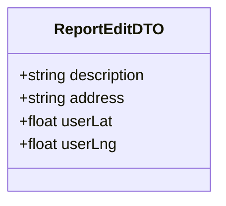
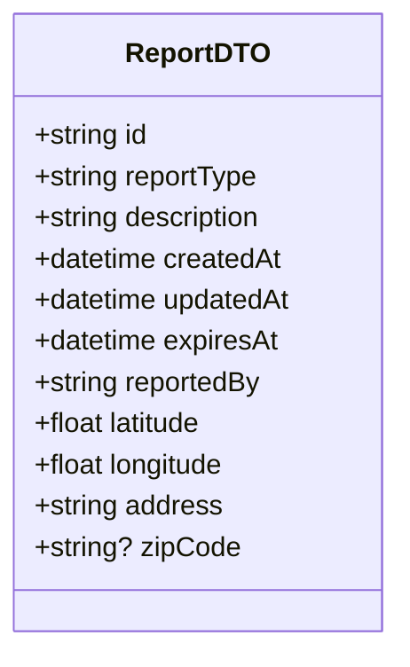

# Edit Report Use Case

OP (original poster) can edit their own report. OP must be physically at the reported location.

## Flow

1. OP navigates to their report
2. OP edits the report details
3. Report is updated and `updatedAt` is refreshed

## Endpoints

### PUT `/reports/:reportId`

**REQUIRES AUTHENTICATED USER**

OP must be the `reportedBy` user and must be within 100 meters of the report's coordinates.

#### Request Body

```json
{
    "description": "updated description", // max 256 chars
    "address": "updated address", // max 256 chars
    "userLat": 40.205, // float number, -90 to 90, user's current latitude
    "userLng": 21.443 // float number, -180 to 180, user's current longitude
}
```



#### Response

```json
{
    "report": {
        "id": "uuid",
        "reportType": "accident",
        "description": "updated description",
        "createdAt": "2026-05-23T08:00:00Z",
        "updatedAt": "2026-05-23T10:30:00Z",
        "expiresAt": "2026-05-23T10:00:00Z",
        "reportedBy": "uuid",
        "latitude": 40.205,
        "longitude": 21.443,
        "address": "updated address",
        "zipCode": "51030"
    }
}
```



#### Failure Responses

| Status | Condition |
|--------|-----------|
| `400` | Missing required fields or invalid values (description/address max 256 chars, userLat -90 to 90, userLng -180 to 180) |
| `401` | Missing or invalid authentication |
| `403` | Authenticated user is not the OP |
| `404` | Report not found |
| `409` | User is not within 100 meters of the report location |
