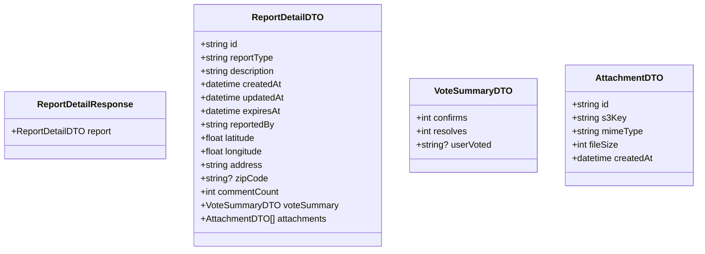
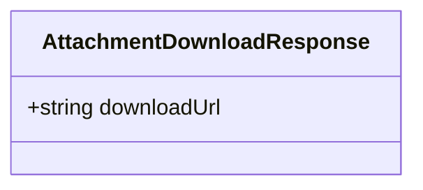

# Get Report Detail Use Case

Fetch full details of a single report, including attachments and vote summary.

## Flow

1. User selects a report from the map or feed
2. Client requests the report detail
3. Server returns the full report with attachments and vote summary
4. Client renders the detail view

## Endpoints

### GET `/reports/:reportId`

Returns the full report. Public; pass the optional `Authorization` header to receive per-user vote context.

Soft-deleted reports (`deletedAt IS NOT NULL`) return `404`. Expired reports remain accessible by ID for historical reference.

#### Response

`200 OK`

```json
{
    "report": {
        "id": "uuid",
        "reportType": "accident",
        "description": "description",
        "createdAt": "2026-05-23T10:00:00Z",
        "updatedAt": "2026-05-23T10:00:00Z",
        "expiresAt": "2026-05-23T12:00:00Z",
        "reportedBy": "uuid",
        "latitude": 40.205,
        "longitude": 21.443,
        "address": "address",
        "zipCode": "51030",
        "commentCount": 2,
        "voteSummary": {
            "confirms": 3,
            "resolves": 1,
            "userVoted": null
        },
        "attachments": [
            {
                "id": "uuid",
                "s3Key": "reports/uuid/image.jpg",
                "mimeType": "image/jpeg",
                "fileSize": 102400,
                "createdAt": "2026-05-23T10:00:00Z"
            }
        ]
    }
}
```

`userVoted` is `"confirm"`, `"resolve"`, or `null`. It is always `null` when the `Authorization` header is absent.



#### Failure Responses

| Status | Condition |
|--------|-----------|
| `404` | Report not found or soft-deleted |

---

### GET `/reports/:reportId/attachments/:attachmentId/download`

Returns a short-lived pre-signed S3 download URL for a single attachment. Public — no authentication required.

The URL expires after 5 minutes. The client should fetch the URL only when the user taps an attachment, then redirect or download immediately.

#### Response

`200 OK`

```json
{
    "downloadUrl": "https://s3.example.com/reports/uuid/image.jpg?X-Amz-..."
}
```



#### Failure Responses

| Status | Condition |
|--------|-----------|
| `404` | Report not found, soft-deleted, or attachment does not belong to the report |
