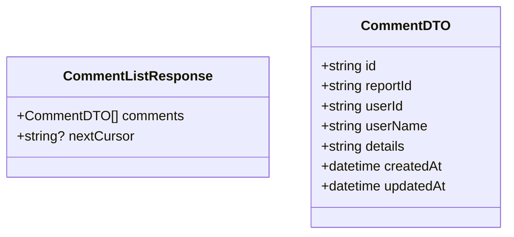

# List Comments Use Case

List comments for a report, ordered chronologically (oldest first).

## Endpoints

### GET `/reports/:reportId/comments`

Public endpoint — no authentication required.

#### Query Parameters

| Param | Type | Default | Notes |
|-------|------|---------|-------|
| `cursor` | string | — | Opaque pagination cursor; omit for first page |
| `limit` | int | 20 | Max 100 |

Cursor is null on the last page. Exceeding the limit returns `400`.

#### Response

`200 OK`

```json
{
    "comments": [
        {
            "id": "uuid",
            "reportId": "uuid",
            "userId": "uuid",
            "userName": "John Doe",
            "details": "comment text here",
            "createdAt": "2026-05-23T10:00:00Z",
            "updatedAt": "2026-05-23T10:00:00Z"
        }
    ],
    "nextCursor": "ZXh...3PQ=="
}
```



#### Failure Responses

| Status | Condition |
|--------|-----------|
| `400` | Invalid `limit` (exceeds 100) |
| `404` | Report not found |
