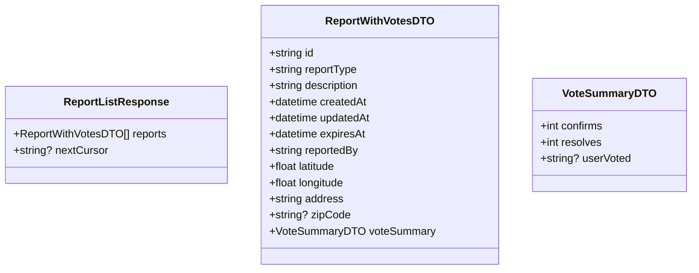
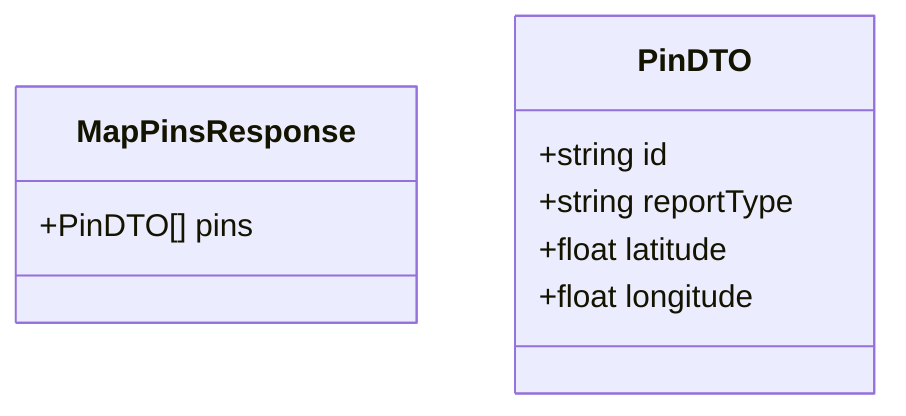

# List Reports Use Case

Fetch reports for the feed/history view or as lightweight map pins.

## Endpoints

### GET `/reports`

Returns reports for the feed or history. Public; pass the optional `Authorization` header to receive per-report vote context.

Soft-deleted (`deletedAt IS NOT NULL`) and expired (`expiresAt <= now`) reports are excluded.

#### Query Parameters

| Param | Type | Default | Notes |
|-------|------|---------|-------|
| `cursor` | string | — | Opaque pagination cursor; omit for first page |
| `limit` | int | 20 | Max 50 |
| `reportType` | string | — | Optional filter, comma-separated (e.g. `accident,flood`) |
| `sort` | string | `createdAt` | `createdAt` or `expiresAt` |
| `order` | string | `desc` | `asc` or `desc` |

Invalid `sort` returns `400`. Cursor is null on the last page.

#### Response

`200 OK`

```json
{
    "reports": [
        {
            "id": "uuid",
            "reportType": "accident",
            "description": "description",
            "createdAt": "2026-05-23T10:00:00Z",
            "updatedAt": "2026-05-23T10:00:00Z",
            "expiresAt": "2026-05-23T12:00:00Z",
            "reportedBy": "uuid",
            "latitude": 40.205,
            "longitude": 21.443,
            "address": "address",
            "zipCode": "51030",
            "voteSummary": {
                "confirms": 3,
                "resolves": 1,
                "userVoted": null
            }
        }
    ],
    "nextCursor": "ZXh...3PQ=="
}
```

`userVoted` is `"confirm"`, `"resolve"`, or `null`. It is always `null` when the `Authorization` header is absent.



#### Failure Responses

| Status | Condition |
|--------|-----------|
| `400` | Invalid `limit` (exceeds 50), invalid `sort`, invalid `reportType` |

---

### GET `/reports/map`

Returns lightweight pin data for map rendering. No pagination, no auth required. Capped at 500 pins.

Soft-deleted and expired reports are excluded.

#### Query Parameters

| Param | Type | Default | Notes |
|-------|------|---------|-------|
| `swLat` | float | — | Required (south-west latitude) |
| `swLng` | float | — | Required (south-west longitude) |
| `neLat` | float | — | Required (north-east latitude) |
| `neLng` | float | — | Required (north-east longitude) |
| `reportType` | string | — | Optional filter, comma-separated |

All four geo params must be present together. Valid ranges: lat [-90, 90], lng [-180, 180].

#### Response

`200 OK`

```json
{
    "pins": [
        {
            "id": "uuid",
            "reportType": "accident",
            "latitude": 40.205,
            "longitude": 21.443
        }
    ]
}
```



#### Failure Responses

| Status | Condition |
|--------|-----------|
| `400` | Missing one or more geo params, invalid ranges, bounding box exceeds 500 pins (zoom in), invalid `reportType` |

---

### GET `/reports/user/me`

Returns the authenticated user's own reports. Always ordered by `createdAt` descending (newest first).

**REQUIRES AUTHENTICATED USER**

Soft-deleted reports are excluded. Expired reports are included so the user can review their full history.

#### Query Parameters

| Param | Type | Default | Notes |
|-------|------|---------|-------|
| `cursor` | string | — | Opaque pagination cursor; omit for first page |
| `limit` | int | 20 | Max 50 |
| `reportType` | string | — | Optional filter, comma-separated (e.g. `accident,flood`) |

Cursor is null on the last page.

#### Response

`200 OK`

Same shape as `GET /reports`, but `voteSummary.userVoted` reflects the authenticated user's vote on each report.

```json
{
    "reports": [
        {
            "id": "uuid",
            "reportType": "accident",
            "description": "description",
            "createdAt": "2026-05-23T10:00:00Z",
            "updatedAt": "2026-05-23T10:00:00Z",
            "expiresAt": "2026-05-23T12:00:00Z",
            "reportedBy": "uuid",
            "latitude": 40.205,
            "longitude": 21.443,
            "address": "address",
            "zipCode": "51030",
            "voteSummary": {
                "confirms": 3,
                "resolves": 1,
                "userVoted": "confirm"
            }
        }
    ],
    "nextCursor": "ZXh...3PQ=="
}
```

#### Failure Responses

| Status | Condition |
|--------|-----------|
| `400` | Invalid `limit` (exceeds 50), invalid `reportType` |
| `401` | Missing or invalid authentication |
