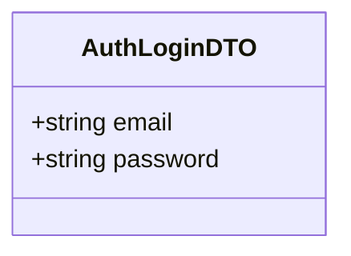
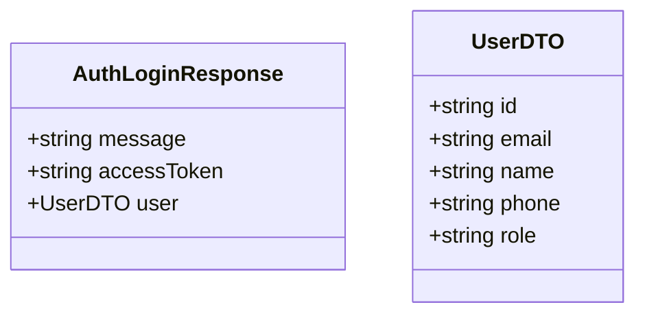

# Login Use Case

A registered user authenticates and receives a JWT access token.

The token is signed with HS256, contains `{ id, email, role }` in the payload, and expires after 1 hour. The token is returned in the JSON response body — the client is responsible for storing it and attaching it to subsequent requests as `Authorization: Bearer <token>`.

## Flow

1. User opens the login screen
2. User enters email and password
3. User submits the login form
4. Server validates credentials and returns an access token
5. Client stores the token and uses it for authenticated requests

## Endpoints

### POST `/auth/login`

Public endpoint — no authentication required.

#### Request Body

```json
{
    "email": "user@example.com",
    "password": "securePassword123"
}
```



#### Response

```json
{
    "message": "Login successful",
    "accessToken": "eyJhbGciOiJI...",
    "user": {
        "id": "uuid",
        "email": "user@example.com",
        "name": "John Doe",
        "phone": "+1234567890",
        "role": "user"
    }
}
```



#### Failure Responses

| Status | Condition |
|--------|-----------|
| `400` | Missing required fields (`email`, `password`) |
| `401` | Invalid credentials (wrong email or password) |
