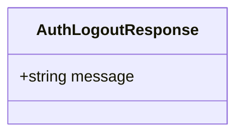

# Logout Use Case

An authenticated user ends their session.

Logout is stateless — the server does not invalidate or blacklist the JWT token. The token remains valid until its natural 1-hour expiry. The client is expected to discard the token on its side.

## Flow

1. User taps logout
2. Client discards the stored access token
3. Server confirms the logout request

## Endpoints

### POST `/auth/logout`

**REQUIRES AUTHENTICATED USER**

`Authorization: Bearer <token>` header is required.

#### Response

```json
{
    "message": "Logout successful"
}
```



#### Failure Responses

| Status | Condition |
|--------|-----------|
| `401` | Missing or invalid token |
