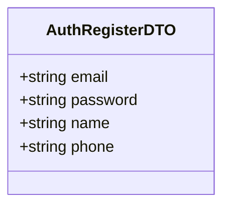
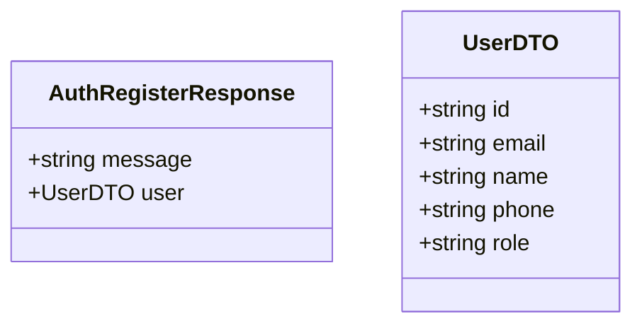

# Register Use Case

A new user creates an account.

Password is hashed with bcrypt (10 salt rounds) before storage. The `role` defaults to `"user"`.

Password must be at least 8 characters and contain at least one uppercase letter, one lowercase letter, and one digit.

## Flow

1. User opens the registration screen
2. User fills in name, email, phone, and password
3. User submits the registration form
4. Account is created and user can proceed to login

## Endpoints

### POST `/auth/register`

Public endpoint — no authentication required.

#### Request Body

```json
{
    "email": "user@example.com",
    "password": "securePassword123",
    "name": "John Doe",
    "phone": "+1234567890"
}
```



#### Response

```json
{
    "message": "Registration successful",
    "user": {
        "id": "uuid",
        "email": "user@example.com",
        "name": "John Doe",
        "phone": "+1234567890",
        "role": "user"
    }
}
```



#### Failure Responses

| Status | Condition |
|--------|-----------|
| `400` | Missing required fields, invalid email format, invalid phone format, or password does not meet strength requirements |
| `409` | Email already registered |
