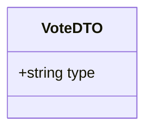
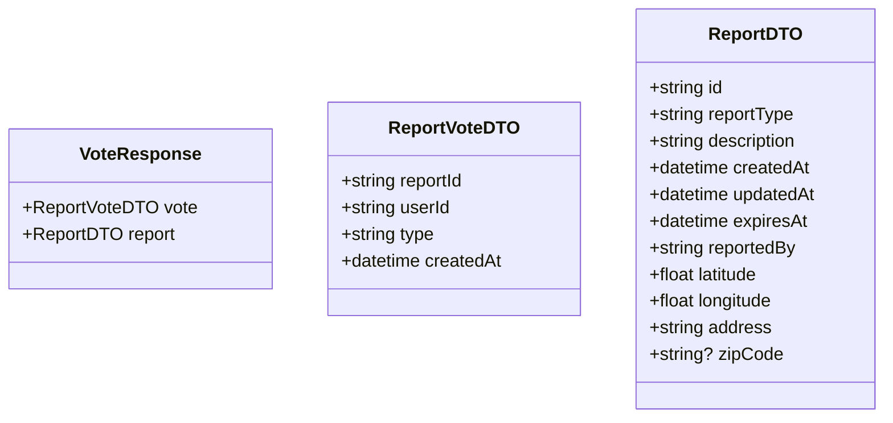

# Resolve Report Use Case

User taps "Resolved" to indicate a hazard is no longer present.

Shortens the report's `expiresAt` by 1 hour, floored at 1 hour past `createdAt`. Confirm and resolve votes are tracked independently — casting one does not block the other.

Rate-limited: one resolve per user per report per 24-hour rolling window.

## Flow

1. User views a report on the map
2. User taps "Resolved"
3. Report's `expiresAt` is shortened by 1 hour

## Endpoints

### POST `/reports/:reportId/vote`

**REQUIRES AUTHENTICATED USER**

#### Request Body

```json
{
    "type": "resolve"
}
```



#### Response

```json
{
    "vote": {
        "reportId": "uuid",
        "userId": "uuid",
        "type": "resolve",
        "createdAt": "2026-05-23T10:00:00Z"
    },
    "report": {
        "id": "uuid",
        "reportType": "accident",
        "description": "description",
        "createdAt": "2026-05-23T08:00:00Z",
        "updatedAt": "2026-05-23T10:00:00Z",
        "expiresAt": "2026-05-23T09:00:00Z",
        "reportedBy": "uuid",
        "latitude": 40.205,
        "longitude": 21.443,
        "address": "address",
        "zipCode": "51030"
    }
}
```



#### Failure Responses

| Status | Condition |
|--------|-----------|
| `400` | Invalid or missing vote type |
| `401` | Missing or invalid authentication |
| `404` | Report not found |
| `409` | Already voted resolve within 24h window |
