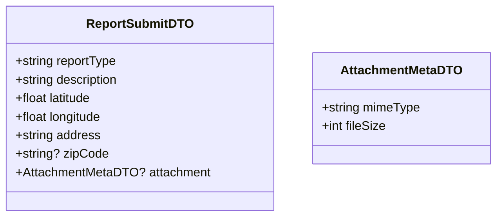
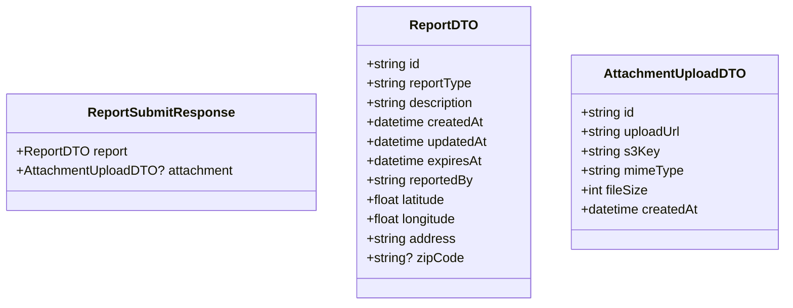

# Submit Report Use Case

User ("original poster"/OP) submits a report.

It should contain general description and current location.

Image is optional.

## Flow

1. User sees a problem
2. User submits a report (with optional attachment metadata)
3. Report is saved and visible to other users
4. If an attachment was requested, the client uploads the file directly to the pre-signed S3 URL

## Endpoints

### POST `/reports`

Creates a new report.

**REQUIRES AUTHENTICATED USER**

#### Request Body

Valid `reportType` values:

| Type | TTL |
|------|-----|
| `accident` | 2h |
| `police` | 2h |
| `hazard` | 2h |
| `crime` | 2h |
| `flood` | 12h |
| `pothole` | 12h |
| `closure` | 24h |
| `construction` | 24h |
| `broken_traffic_light` | 24h |
| `other` | 6h |

```json
{
    "reportType": "accident",
    "description": "description", // max 256 chars
    "latitude": 40.205, // float number, -90 to 90
    "longitude": 21.443, // float number, -180 to 180
    "address": "address", // max 256 chars
    "zipCode": "51030", // optional
    "attachment": { // optional
        "mimeType": "image/jpeg",
        "fileSize": 102400
    }
}
```



#### Response

```json
{
    "report": {
        "id": "uuid",
        "reportType": "accident",
        "description": "description",
        "createdAt": "2026-05-23T10:00:00Z",
        "updatedAt": "2026-05-23T10:00:00Z",
        "expiresAt": "2026-05-23T12:00:00Z",
        "reportedBy": "uuid",
        "latitude": 40.205,
        "longitude": 21.443,
        "address": "address",
        "zipCode": "51030"
    },
    "attachment": { // only if attachment was provided
        "id": "uuid",
        "uploadUrl": "s3 pre-signed url",
        "s3Key": "reports/uuid/image.jpg",
        "mimeType": "image/jpeg",
        "fileSize": 102400,
        "createdAt": "2026-05-23T10:00:00Z"
    }
}
```



#### Failure Responses

| Status | Condition |
|--------|-----------|
| `400` | Missing required fields, invalid values, unrecognized `reportType`, or coordinates out of range (latitude: -90 to 90, longitude: -180 to 180) |
| `401` | Missing or invalid authentication |
